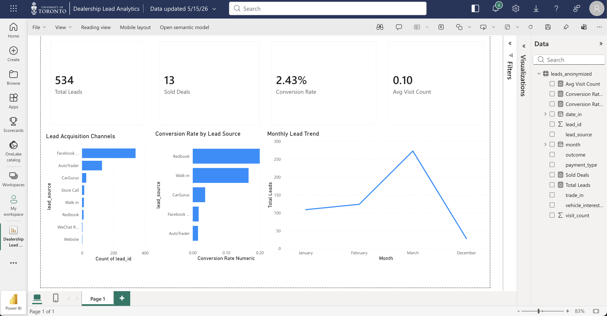

# Dealership Lead Source Performance Analytics

## Project Overview

This project analyzes 534 anonymized customer leads from a real used-car dealership to evaluate lead generation performance, sales conversion efficiency, and customer acquisition quality across multiple sales channels.

The objective was to build a real-world business intelligence workflow that transforms raw dealership lead data into actionable business insights through SQL analysis, Python, Streamlit, and Power BI.

The dashboard helps answer key operational and marketing questions such as:

- Which platforms generate the most customer inquiries?
- Which channels produce the highest conversion rates?
- Which lead sources generate real sold deals?
- Which channels create low-quality or low-intent leads?
- Where should future advertising budget be allocated?

---

# Live Dashboard

Streamlit Application:  
https://dealership-lead-analytics-xbcgzu3suriteg9tvzpbey.streamlit.app/

---

# Technologies Used

- PostgreSQL
- SQL
- Python
- Pandas
- Plotly
- Streamlit
- Power BI
- Excel / CSV Data Cleaning
- GitHub

---

# Business Problem

High lead volume does not always translate into high business value.

Many dealerships focus heavily on total inquiry counts, but some lead sources generate large amounts of low-intent traffic that consume salesperson time without producing meaningful sales opportunities.

This project demonstrates why dealerships should evaluate:

- Lead Quality
- Conversion Efficiency
- Sales Funnel Performance
- Customer Intent
- Marketing ROI

instead of relying only on total lead volume.

---

# Business Questions Answered

- Which lead sources generate the most inquiries?
- Which channels produce actual sold deals?
- Which sources have the highest close rate?
- How do lead trends change over time?
- Which channels should receive future advertising budget?

---

# Key Findings

## 1. Facebook Marketplace and AutoTrader generated the highest lead volume

Facebook Marketplace and AutoTrader produced the largest number of customer inquiries.

However, many of these inquiries appeared to be low-intent interactions, including:

- One-click “Is this still available?” messages
- Automatic inquiry templates
- Carfax-only requests
- Low follow-up engagement

These channels provide strong visibility but weaker lead quality.

---

## 2. Higher-intent channels converted more efficiently

Channels such as:

- CarGurus
- Walk-in traffic
- Redbook referrals

showed significantly stronger conversion performance.

These customers were typically:

- Further along in the buying process
- More responsive during follow-up
- More likely to visit the dealership
- Higher intent buyers

---

## 3. Walk-in traffic showed strong purchase intent

Walk-in customers demonstrated one of the strongest conversion profiles because they had already committed time and effort to physically visit the dealership.

This behavior often signals significantly stronger buying intent compared to casual online inquiries.

---

## 4. Lead volume alone can be misleading

If management only measures total inquiry count, Facebook Marketplace appears dominant.

However, when analyzing actual conversion performance, smaller lead channels frequently outperform high-volume platforms.

This reinforces the importance of tracking:

- Conversion Rate
- Appointment Rate
- Showroom Visits
- Lead Quality
- Sales Efficiency

---

# Business Recommendations

## Continue Using Facebook Marketplace & AutoTrader for Awareness

These platforms remain valuable for:

- Inventory exposure
- Brand visibility
- Top-of-funnel awareness

---

## Improve Lead Qualification Process

Implement better filtering and prioritization through:

- Automated responses
- Appointment scheduling
- Lead scoring
- Faster response workflows

---

## Increase Focus on Higher-Converting Channels

Allocate additional attention and marketing focus toward:

- CarGurus
- Referral-based traffic
- Walk-in acquisition strategies

---

## Expand Future KPI Tracking

Future data collection should include:

- Advertising spend by platform
- Appointment booking rate
- Show-up rate
- Gross profit per deal
- Time-to-close
- Salesperson performance

---

# Skills Demonstrated

- SQL aggregation & KPI analysis
- Data cleaning & transformation
- Dashboard development
- Business intelligence reporting
- Conversion funnel analysis
- Executive storytelling with data
- Marketing performance analytics
- GitHub deployment
- Streamlit application deployment
- Power BI dashboard development

---

# Project Files

| File | Description |
|---|---|
| `app.py` | Streamlit dashboard application |
| `queries.sql` | SQL business analysis queries |
| `powerbi:dealership_dashboard.pbix` | Power BI dashboard |
| `data/leads_anonymized.csv` | Clean anonymized dealership dataset |
| `README.md` | Project documentation |

---

# Future Improvements

- Predictive lead scoring model
- Monthly sales forecasting
- Marketing ROI dashboard
- Cost-per-acquisition tracking
- CRM automation recommendations
- Salesperson performance analytics

---

## Power BI Dashboard Preview

# GitHub Repository

https://github.com/heyangzzhang-wq/dealership-lead-analytics
